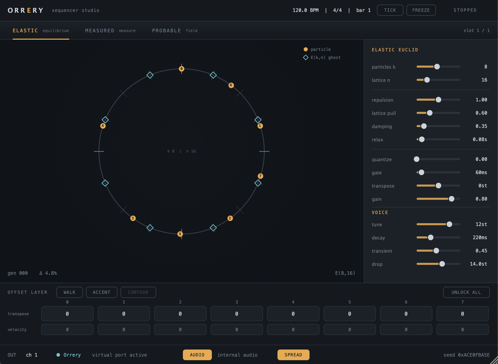
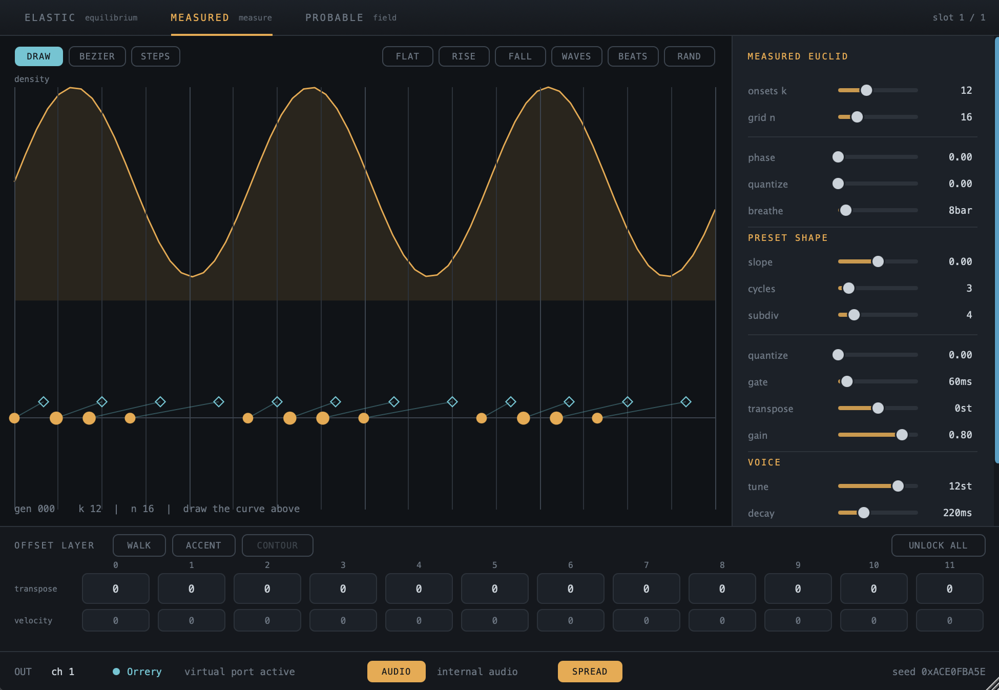
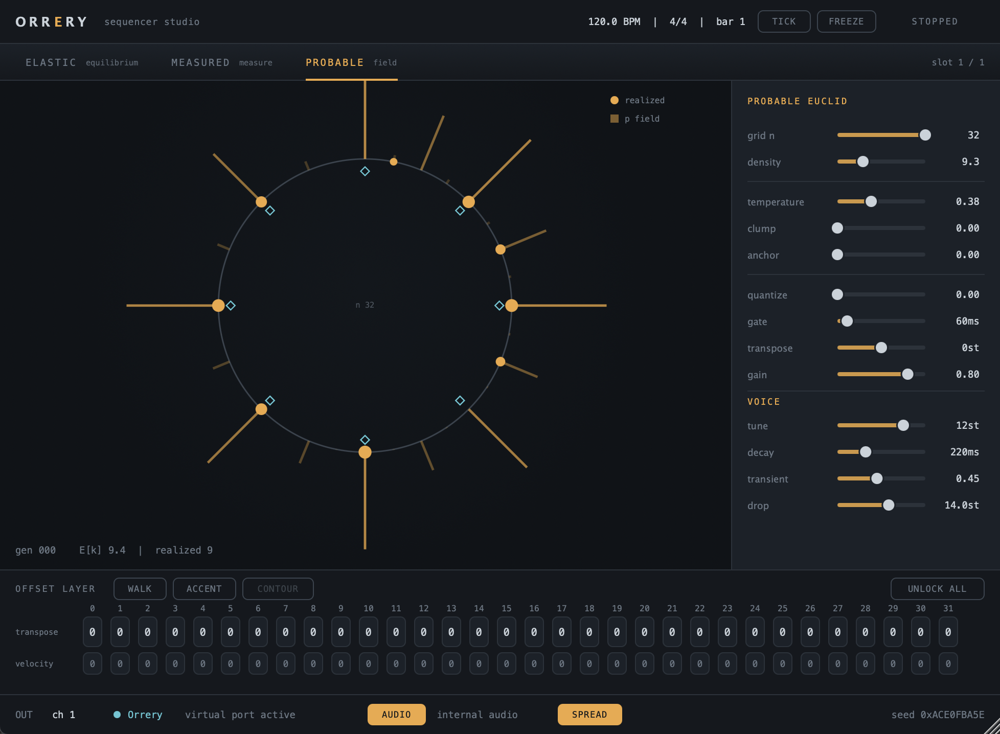
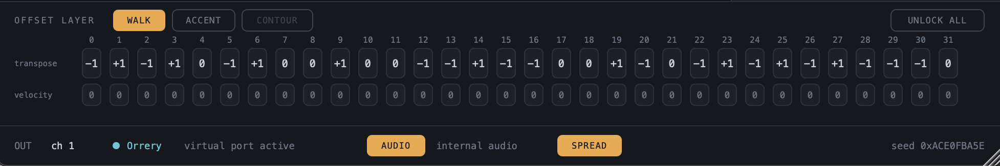

# Orrery — a generative sequencer studio

*Last verified current: 2026-08-18. Live phase status lives in
[ROADMAP.md](ROADMAP.md) and nowhere else — this file describes what Orrery
**is**, not where it is in its build order.*

**Orrery** is a single JUCE/C++20 audio plugin (VST3 · AU · Standalone) that
hosts several deterministic generative rhythm **engines** behind one shared
contract. Each engine is a different answer to the same question — *where do the
onsets go?* — and they all feed one clock, one decoration layer, one MIDI
router, and one trace system.

It emits **MIDI** to drive other instruments, and has an internal percussion
voice so it makes sound on its own.



---

## The engines

Three engines ship today, selectable from the tabs. They share the seam, not the
idea:

| Engine | The idea | What you turn |
|---|---|---|
| **Elastic Euclid** | Euclidean rhythm as the **equilibrium of a physical system** — particles on a ring with pairwise repulsion, a lattice potential, and damping. E(k,n) is where it *settles*, not what it computes. Kick it and it relaxes back over audible bar-to-bar generations. | particles, lattice `n`, repulsion, lattice pull, damping, relax |
| **Measured Euclid** | Onsets spaced evenly **under a measure** — you draw a density curve, and onsets crowd where it's high and spread where it's low. A flat curve at full quantize *is* classic Euclid; it's a special case, not a mode. | draw/bezier/steps curve editing, onsets `k`, grid, phase, quantize, breathe |
| **Probable Euclid** | The pattern is a **probability field**, not a pattern. Each bar samples one seeded realization, so density is continuous — `d = 5.5` is a real rhythm that hovers between E(5,n) and E(6,n). | density, temperature, clump, anchor, freeze |




Also in the repo, specs validated but not yet built: **Torus Euclid**,
**Kuramoto Rotors**, **Coupled Rings**.

## The offset layer — hand edits are pins

Between every engine and the MIDI out sits one decoration stage: per-source
**transpose** and **velocity** cells, plus a sub-tick **timing** lane.
Generators (`walk`, `accent`) rewrite those cells at each bar — but they **skip
any cell you've touched**. Your edits are pins; the generators flow around them.
That coexistence rule is the heart of the design, and it's why the lane shows
locks.



## Determinism is the substrate

Every value Orrery emits is reproducible. One project seed derives a PCG32
stream per engine slot plus one for the offset layer; engines never read a wall
clock, never allocate on the audio thread, and evaluate in a fixed order. A
trace plus the project state reconstructs a performance exactly.

That isn't a slogan — it's gated. `./verify fast` runs the structural gate, a
privacy/leak gate, and the full test suite: bit-identical whole-pipeline
determinism, ±1-sample clock timing across a sweep of rates/tempos/divisions,
per-engine acceptance tests taken from each engine's spec, and a **0-allocations
RT gate** that drives the real audio path under an allocation hook.

## Routing it

- **MIDI out** — Orrery emits on the plugin's MIDI bus *and* opens its own
  CoreMIDI virtual port named **`Orrery`**.
- **In Ableton Live**, use that port: enable **`Orrery`** under
  *Preferences → Link/Tempo/MIDI*, then set a track's **MIDI From → Orrery**.
  Live cannot route a plugin's MIDI bus between tracks, and it has no
  third-party MIDI-device slot at all — so the virtual port is the path.
- **In Reaper / Bitwig / Cubase / Studio One / Logic**, the MIDI bus works
  directly, and there's an `Orrery MFX` MIDI-effect build that drops *before* an
  instrument in the same track.
- **Internal audio** can be switched off, making Orrery a silent MIDI generator;
  **transpose** shifts the whole output for drum-pad or register targeting.

Full detail, including why the MFX build is deliberately not installed for
Ableton: [`shell/plugin/ROUTING.md`](shell/plugin/ROUTING.md).

## Layout

```
sequencer-studio-architecture.md   THE CONTRACT — the IEngine seam + station services
shell/core/                        framework-free C++20: clock, offset layer, router,
                                   trace, PCG32   (no JUCE — enforced by a build gate)
shell/plugin/                      the JUCE shell: plugin, GUI, MIDI out, RT gate
engines/<name>/                    one territory per engine: spec + prototype +
                                   its own acceptance tests + its own view
```

Each engine depends on the contract and nothing else — never on the shell's
internals or a sibling. The core is deliberately framework-free, which is what
lets the sister project **[Lathe](https://github.com/Lifted-Truck/Lathe)** consume
it as a shared substrate (it pins `core-v1.2.0`); cross-repo exchanges live in
[`integrations/`](integrations/).

## Build

```bash
./verify fast          # structural + leak gates, core build, full test suite
```

The plugin build (JUCE, VST3/AU/Standalone) and its validation are macOS-local
and human-run — `auval`, the codesign re-seal, and installing to `~/Library`
hit sandbox and signing behaviour that CI can't stand in for:

```bash
cmake -S . -B build-plugin -G "Unix Makefiles" -DCMAKE_BUILD_TYPE=Release -DORRERY_BUILD_PLUGIN=ON
cmake --build build-plugin -j
tools/validate_au.sh   # install + auval  (run in a real terminal)
```

Ship **Release**, never Debug: a Debug JUCE plugin turns any fired assertion
into a SIGTRAP the host kills. Validate with `pluginval`, not just `auval`.

## Where things are decided

[ROADMAP.md](ROADMAP.md) — direction and live phase status (the single source) ·
[DECISIONS.md](DECISIONS.md) — append-only record of every choice and what was
rejected · [CLAUDE.md](CLAUDE.md) — the agent charter and invariants ·
each engine's `CLAUDE.md` — that engine's own domain notes and measured limits.
